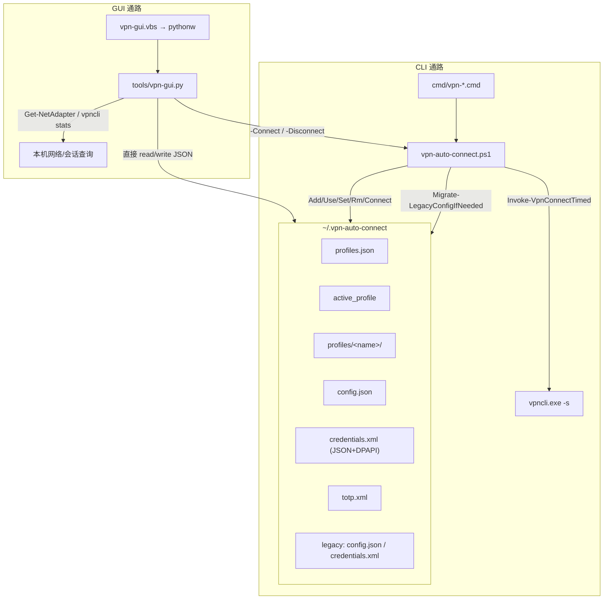
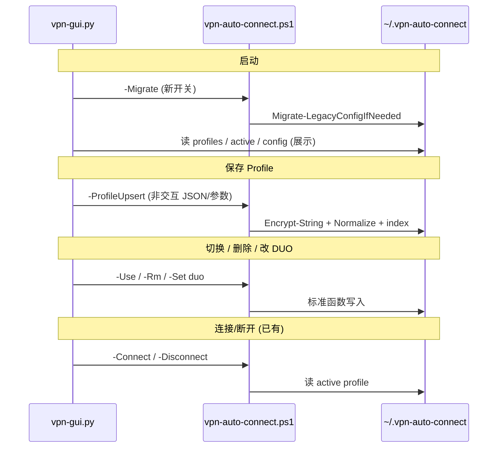

# GUI / CLI 数据通路与配置对齐方案

## 当前架构：两条通路，一个存储

两者共享同一配置目录 `~/.vpn-auto-connect/`，但**读写职责分裂**：



---

## CLI 数据通路（完整）

| 阶段 | 入口 | 执行路径 | 数据源 |
|------|------|----------|--------|
| 配置查看 | `vpn-config` | [`vpn-auto-connect.ps1`](vpn-auto-connect.ps1) `-Config` → `Show-Config` | 读 `profiles/*` + `active_profile` |
| 配置变更 | `vpn-config add/use/set/rm/totp` | PS1 交互函数：`Add-VpnProfile` / `Use-VpnProfile` / `Set-VpnSetting` / `Remove-VpnProfile` / `Save-TOTP` | 写 profile 目录 |
| 启动迁移 | 任意 PS1 调用 | `Migrate-LegacyConfigIfNeeded`（根目录 legacy → `profiles/default`） | 写 index + active |
| 连接 | `vpn-connect [duo]` | `Connect-Vpn` → 读 `Load-ActiveProfileCredentials` + `Load-ActiveProfileConfig`（fallback legacy）→ `Invoke-VpnConnectTimed` → `vpncli` | active profile |
| DUO 解析 | `-DuoMethod` 参数 | 优先级：**显式参数 > `config.DuoMethod` > 默认 push** | `config.json` |
| 断开 | `vpn-disconnect` | `Disconnect-Vpn` → `Invoke-VpnCliDisconnectQuiet` + 重启 `csc_ui` | — |
| 状态 | `vpn-status` | `Get-VpnStatus` → Cisco 隧道网卡 → `10.x` fallback | 本机网卡 |

关键连接逻辑（CLI 单一真相）：

```2143:2157:vpn-auto-connect.ps1
    # Resolve DUO method: explicit param > config saved value > default "push"
    $effectiveDuo = $DuoMethod
    if (-not $PSBoundParameters.ContainsKey('DuoMethod') -and $config.DuoMethod) {
        $effectiveDuo = $config.DuoMethod
    }
    ...
    $configuredPushTarget = Normalize-DuoPushTarget -Value $config.DuoPushTarget
```

---

## GUI 数据通路（完整）

| 阶段 | 实现位置 | 执行路径 | 数据源 |
|------|----------|----------|--------|
| 启动读配置 | [`tools/vpn-gui.py`](tools/vpn-gui.py) `_load_*` | **Python 直接读** `profiles.json` / `active_profile` / `profiles/<name>/config.json` | 同目录 |
| Profile 增删改 | `_save_profile` / `_remove_profile` | **Python 直接写** JSON + 内联 PowerShell DPAPI 加密 | **不经过 PS1** |
| 切换 Profile | `_on_profile_change` | 写 `active_profile` 文件 | 不调用 `-Use` |
| 连接 | `_connect` | `powershell -File vpn-auto-connect.ps1 -Connect -DuoMethod <gui选择> -NonInteractiveMfa` | PS1 读 active profile |
| 断开 | `_disconnect` | `-Disconnect` | PS1 |
| 状态/计时 | `_refresh_status` / `_query_vpn_*` | **独立** PowerShell 内联 + `vpncli stats` + Cisco state 文件 | 不复用 `-Status` |

GUI 当前连接调用：

```1467:1473:tools/vpn-gui.py
    def _connect(self):
        ...
        self._run_vpn_cmd(["-Connect", "-DuoMethod", method, "-NonInteractiveMfa"], timeout=240)
```

---

## 已识别的不一致（需对齐）

| 问题 | CLI 行为 | GUI 行为 | 风险 |
|------|----------|----------|------|
| **配置写入** | 统一经 PS1 `Encrypt-String` / `Normalize-DuoPushTarget` / `Save-ProfilesIndex` | Python 直写 + 独立 `_normalize_push_target` | 字段格式、加密方式可能分叉 |
| **Legacy 迁移** | PS1 启动即 `Migrate-LegacyConfigIfNeeded` | GUI 不触发迁移 | 仅用过 GUI 的用户 legacy 配置永不进 profile |
| **凭据 fallback** | 仅 DPAPI `Decrypt-String` | PS 加密失败时写 **plain base64** (`_save_cred_fallback`) | CLI 连接解密失败 |
| **Profile 名** | `Add-VpnProfile` 过滤 `[^a-zA-Z0-9_-]` | 自定义名无过滤 | 路径/索引异常 |
| **DuoMethod 持久化** | `vpn-config set duo` 写入 `config.json`；`vpn-connect` 无参时用保存值 | 主界面 radio 仅影响当次 `-DuoMethod`，**不自动写回 config** | GUI 改 DUO 后 CLI `vpn-connect` 行为不同 |
| **Config 展示** | `Show-Config` 显示 PushTo、TOTP，**不显示 DuoMethod** | Configs 对话框同样缺 DuoMethod | 用户看不到保存的默认 DUO |
| **TOTP** | `vpn-config totp` 完整支持 | 无配置入口，仅 connect 选 TOTP | passcode 模式在 GUI 不可用 |
| **删除 Profile** | `Remove-VpnProfile` 更新 active 逻辑 | GUI 自实现，大体相同但未复用 PS1 | 边界情况（删最后一个）可能微差 |
| **状态检测** | `Get-VpnTunnelAddress` | GUI 内联重复 PS 逻辑 | 逻辑漂移（目前基本一致） |

---

## 对齐策略（你已选：GUI 配置写入委托 PS1）

目标：**读可以留在 GUI（快）**，**写必须经 PS1（单一真相）**。



---

## 实现步骤

### 1. 在 PS1 增加非交互 Profile API

在 [`vpn-auto-connect.ps1`](vpn-auto-connect.ps1) 新增：

- **`-Migrate`**：只跑 `Migrate-LegacyConfigIfNeeded` 后 `exit 0`（供 GUI 启动调用）
- **`-ProfileUpsert`** + 结构化参数（或 `-ProfileJsonPath` 指向临时 JSON）：
  - 字段：`Name, Server, Group, Port, Protocol, Username, Password, DuoMethod, DuoPushTarget, PreservePassword`
  - 内部复用现有 `Encrypt-String`、`Normalize-DuoPushTarget`、`Save-ProfilesIndex`、`Set-ActiveProfile`
  - 名称消毒：与 `Add-VpnProfile` 相同 `[^a-zA-Z0-9_-]` 过滤
  - `PreservePassword=true` 时只更新 config + cred 的 Server/Username，不重加密密码
- **`-Rm -Confirm:$false`** 或 **`-Force`**：供 GUI 删除时跳过 `Read-Host` 确认（GUI 已有 messagebox）
- **`-ConfigJson`**（可选但推荐）：输出机器可读 JSON（profiles + active + 每 profile 的 config/cred 元数据），供 `_show_configs` 与 CLI 展示完全一致

提取公共函数 `Save-VpnProfileCore`，让 `Add-VpnProfile` 与 `-ProfileUpsert` 共用，避免第三套逻辑。

### 2. 改造 GUI 写入路径

在 [`tools/vpn-gui.py`](tools/vpn-gui.py)：

| 原方法 | 改为 |
|--------|------|
| `_save_profile` | 调用 `-ProfileUpsert`；删除 `_save_cred_fallback` |
| `_remove_profile` | 调用 `-Rm <name> -Force` |
| `_save_active_profile` / `_on_profile_change` | 调用 `-Use <name>` |
| `App.__init__` | 启动时调用 `-Migrate` |
| DUO radio 变更（新增 trace） | 调用 `-Set duo -SetValue <method>` 写回 active profile |
| `_connect` | 无 `-DuoMethod` 时让 PS1 用 `config.DuoMethod`（与 CLI `vpn-connect` 一致）；或保留显式传参但确保已持久化 |

保留 GUI 的 **读路径**（`_load_profiles` 等）用于快速刷新下拉框；保存/删除/切换后重新 `_refresh_profiles()`。

### 3. 统一 Config 展示

- PS1 `Show-Config` / `-ConfigJson` 增加 **`DuoMethod`** 行
- GUI `_show_configs` 改为解析 `-ConfigJson`（或读 config 时显示 `DuoMethod`），与 `vpn-config` 输出字段一致
- TOTP 状态：展示 `(saved)/(not set)`，暂不提供 GUI 录入（可链到 CLI 说明）；后续如需再加 `-SaveTOTP` 对话框

### 4. 清理与验证

- 删除 GUI 中重复的 `_normalize_push_target`（改读 PS1 写回结果）或保留只读校验、写入交给 PS1
- 确认 `-NonInteractiveMfa` 仍传给 `-Connect`（多手机 DUO push 菜单场景）
- 手动验证矩阵：

| 操作 | CLI 验证 | GUI 验证 |
|------|----------|----------|
| GUI 新建 dku profile | `vpn-config` 可见相同字段 | 重开 GUI 下拉正确 |
| GUI 改 DUO → `vpn-connect` | 无参连接用新 DuoMethod | GUI 连接成功 |
| CLI `vpn-config set push-target 2` | — | GUI Configs 显示 PushTo=2 |
| Legacy 仅根目录 config | `vpn-config` 有 default profile | GUI 启动后也能看到 |
| passcode + totp | `vpn-connect passcode` | GUI 选 TOTP 且 profile 有 totp.xml |

### 5. 文档

更新 [`AGENTS.md`](AGENTS.md)「GUI Data Paths」：明确 **配置写操作经 PS1**；连接/断开/状态分工不变。

---

## 不在本次范围（刻意不做）

- GUI 内实现 TOTP 扫码/录入（可后续加 `-SaveTOTP` 包装）
- 把 GUI 状态查询改为调用 `-Status`（逻辑已对齐，重复代码可另开 refactor）
- 实现已文档提及但 PS1 未支持的 `sms` DUO 方法

---

## 关键文件

- 核心逻辑：[`vpn-auto-connect.ps1`](vpn-auto-connect.ps1)（新增 API + `Save-VpnProfileCore` + Config 展示）
- GUI 改造：[`tools/vpn-gui.py`](tools/vpn-gui.py)（删除直写、改 `_run_vpn_cmd` 复用）
- 文档：[`AGENTS.md`](AGENTS.md)
